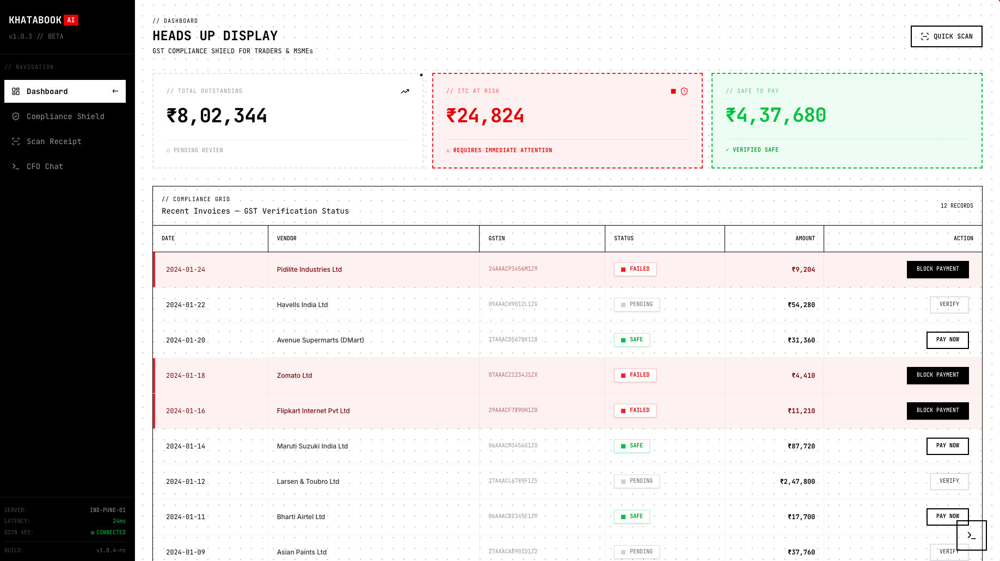

# GST Shield

A proactive GST compliance checker that validates vendor tax status before payment, built for Indian freelancers and small businesses.

[](https://khatabook-ai-hackathon.vercel.app/)
[](https://nextjs.org/)
[](LICENSE)



## Why I Built This

I built this for a hackathon after learning about a frustrating problem in Indian tax compliance: if you pay a vendor and claim Input Tax Credit (ITC), but that vendor never files their GST return, your ITC claim gets rejected during audit. You effectively pay the tax twice—a 36% loss on the expense.

Existing accounting software only tracks expenses *after* payment. By then, the damage is done. I wanted to build something that checks vendor compliance *before* you commit to paying, so you can make informed decisions upfront.

## How It Works

```
┌─────────────────────────────────────────────────────────────┐
│                        User Interface                        │
│            Next.js 16 / React 19 / Tailwind CSS              │
└─────────────────────────────┬───────────────────────────────┘
                              │
                              ▼
┌─────────────────────────────────────────────────────────────┐
│                    API Routes (Serverless)                   │
│   /api/scan • /api/compliance • /api/chat • /api/gstr3b      │
└──────────┬────────────────────────────┬─────────────────────┘
           │                            │
           ▼                            ▼
┌────────────────────┐      ┌────────────────────────────────┐
│   Claude (Sonnet)  │      │   Neon (serverless Postgres)   │
│   via FastRouter   │      │   • compliance_records         │
│   • Vision OCR     │      │   • parameterised SQL          │
│   • CFO chat       │      │   • baked sample fallback ◀────┼── never empty
└─────────┬──────────┘      └────────────────────────────────┘
          │
          ▼
┌─────────────────────────────────────────────────────────────┐
│   Deterministic GSTIN validator                             │
│   format + state code + mod-36 checksum → clear verdict     │
└─────────────────────────────────────────────────────────────┘
```

**The flow:**
1. User uploads a receipt image (can be crumpled, handwritten, Hindi-English mixed)
2. Claude's vision API extracts merchant name, GSTIN, amount, and the full GST breakdown
3. A deterministic GSTIN validator runs on top of the extraction and returns the authoritative verdict
4. Dashboard shows status: SAFE (pay), FAILED (block), or PENDING (hold tax portion)

There's also a chat interface where you can ask natural language questions about your expenses ("Which vendor has the highest pending ITC?"), answered from your current records.

## 🔧 Key Technical Decisions

- **Claude's vision API for OCR instead of dedicated OCR libraries**: Traditional OCR solutions like Tesseract struggle with real-world Indian receipts—crumpled paper, mixed Hindi-English text, handwritten notes, and inconsistent formats. Claude's vision model handles these edge cases natively without preprocessing pipelines or language-specific training.

- **A deterministic validator on top of the AI**: The model's extraction is only a first pass. I run a deterministic GSTIN validator (15-character format, valid state code, and the official mod-36 checksum) on top of the OCR output, and *that* decides the verdict. This keeps the compliance call honest and reproducible rather than trusting a model's guess.

- **Baked fallback so the demo is never broken**: Every read path tries Neon first and, on any error or empty result, falls back to a baked sample dataset from a single source of truth. When the fallback is active the UI shows an honest "Sample data" badge. The dashboard, stats, GSTR-3B export, and CFO chat all work on a cold start or with the database unreachable, and the app builds and runs with no environment variables at all.

- **Neon over a heavier database layer**: All database access is server-side through API routes, so there's no anon/RLS surface to reason about—the connection string is the only secret. Neon's serverless driver suits Vercel's request model and auto-resumes on its own, so the health check is a real `SELECT count(*)` rather than a keepalive.

## 🛠️ Tech Stack

- **Frontend**: Next.js 16, React 19, TypeScript, Tailwind CSS, shadcn/ui
- **Backend**: Next.js API Routes (serverless on Vercel)
- **Database**: Neon (serverless Postgres) with a baked sample-data fallback
- **AI**: Claude (Sonnet) via FastRouter for receipt OCR and chat
- **Deployment**: Vercel

## 🚀 Getting Started

### Prerequisites

- Node.js 20+
- Neon account (free tier works)
- FastRouter API key

### Setup

```bash
git clone https://github.com/Ndhakeph/khatabook-GSTshield.git
cd khatabook-GSTshield
npm install
```

Create `.env.local`:

```env
NEON_DATABASE_URL=your_neon_connection_string
FASTROUTER_API_KEY=your_fastrouter_api_key
```

> Both are optional for a first run. With no `NEON_DATABASE_URL`, the dashboard serves baked sample data; with no `FASTROUTER_API_KEY`, the live AI features show a friendly "add a key" state. Neither one missing will crash the app.

Apply the schema and seed realistic sample data (idempotent):

```bash
npm run seed
```

Start the dev server:

```bash
npm run dev
```

Open [http://localhost:3000](http://localhost:3000).

## Project Structure

```
app/
├── api/
│   ├── scan/route.ts        # Receipt OCR + GSTIN validation
│   ├── compliance/route.ts  # Records CRUD + stats
│   ├── chat/route.ts        # AI CFO chat
│   └── gstr3b/route.ts      # GSTR-3B PDF report
├── chat/page.tsx
├── compliance/page.tsx
└── page.tsx
lib/
├── db/
│   └── neon.ts              # Lazy tagged-template sql client
├── services/
│   ├── ai-service.ts        # FastRouter (Claude) wrapper
│   └── compliance-service.ts
├── gstin.ts                 # Deterministic GSTIN validator
├── demo-records.json        # Sample data — single source of truth
├── demo-data.ts             # Typed export of the baked fallback
└── stats.ts                 # Pure stats helper
scripts/
├── schema.sql               # Neon schema (no RLS)
└── seed.mjs                 # Idempotent seed (npm run seed)
```

## What I Learned

The hardest part wasn't the AI integration—Claude's vision API handled receipt parsing better than I expected, even on low-quality images. The real challenge was understanding the GST compliance domain itself: learning what GSTIN formats look like, how the mod-36 checksum is computed, how ITC claims work, and why the timing of compliance checks matters. Building the deterministic validator taught me not to let a model's confidence stand in for a verifiable rule.

The other lesson was about making a public demo genuinely unattended. Wiring up Neon was easy; making the app *never* break was the interesting part. I ended up funnelling every read through a single fallback path to baked sample data, with an honest badge when it's active, so a cold start or a paused database degrades to "sample data" instead of an error screen—and the build still succeeds with no environment variables at all.

## License

MIT — See LICENSE file
